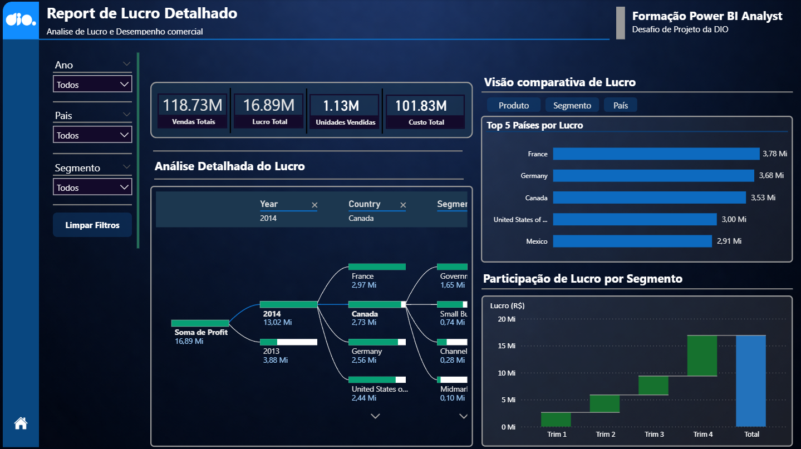
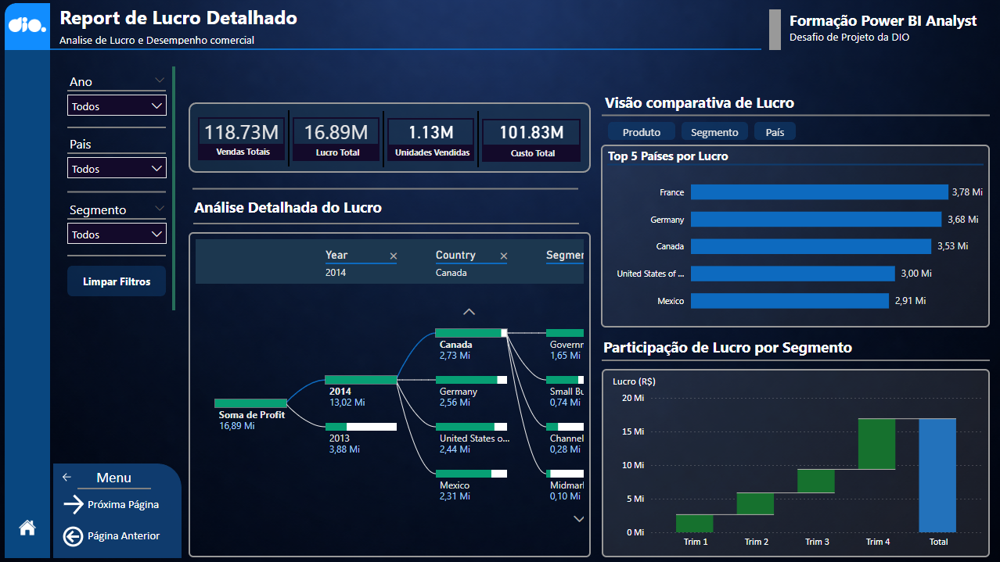

  

  Dashboard desenvolvido em <b>Power BI</b> com foco em <b>análise de lucro</b>, <b>desempenho comercial</b> e <b>visualização estratégica de indicadores</b>, combinando tema escuro, identidade em tons de azul e destaque em amarelo para reforçar a proposta visual ligada a <b>Business Intelligence</b>.

  
  
  
  
  
  

---

## `> overview`

Este projeto apresenta um <b>dashboard completo em Power BI</b>, desenvolvido como parte de um desafio prático da <b>DIO</b>, com liberdade total para definir a estrutura analítica, identidade visual e experiência de navegação.

A proposta foi transformar dados em uma interface mais estratégica, moderna e visualmente forte, combinando <b>análise de indicadores</b>, <b>exploração interativa</b> e <b>apresentação profissional</b> para portfólio na área de <b>Dados e Business Intelligence</b>.

---

## `> business_focus`

O dashboard foi construído para destacar a performance de negócio com foco em:

- lucro total
- vendas totais
- custo total
- unidades vendidas
- comparação de lucro por país
- participação de lucro por segmento
- análise detalhada com filtros dinâmicos

---

## `> key_features`

Principais diferenciais do projeto:

- layout autoral com tema escuro
- painel visual com identidade mais executiva
- navegação interativa entre telas
- menu lateral customizado
- filtros por ano, país e segmento
- comparação visual de lucro por dimensão
- foco em clareza, hierarquia visual e leitura gerencial

---

## `> visuals_created`

Os principais elementos analíticos desenvolvidos no relatório foram:

- <b>cards de KPI</b> para vendas, lucro, unidades vendidas e custo
- <b>gráfico de barras</b> para Top 5 países por lucro
- <b>gráfico waterfall</b> para participação de lucro por segmento
- <b>visual analítico detalhado</b> para exploração do lucro
- <b>segmentadores</b> para filtros dinâmicos
- <b>menu de navegação</b> com interação entre páginas

---

## `> visual_design`

O projeto foi pensado com forte preocupação visual, buscando uma apresentação mais sofisticada e alinhada a dashboards corporativos. Entre os pontos trabalhados:

- tema escuro
- contraste entre azul e amarelo
- organização em blocos visuais
- cards com destaque para KPIs
- cabeçalho estilizado
- navegação mais intuitiva
- composição voltada para portfólio profissional

---

## `> project_structure`

    dashboard-desempenho-financeiro
    │
    ├── BI/
    │   └── dashboard-desempenho-financeiro.pbix
    │
    ├── Images/
    │   ├── Dash.png
    │   └── Dash_Menu.png
    │
    └── README.md

---

## `> preview`

### Dashboard principal

  

### Navegação com menu interativo

  

---

## `> skills_applied`

- Power BI
- Business Intelligence
- visualização de dados
- construção de dashboards
- design de interface analítica
- storytelling com dados
- organização visual de KPIs
- experiência de navegação em relatórios
- análise de desempenho comercial

---

## `> project_goal`

O objetivo deste projeto foi ir além da construção de um relatório básico, desenvolvendo um dashboard com identidade própria, estrutura analítica clara e apresentação visual mais refinada.

Além da parte técnica, o foco também esteve em criar um material forte para portfólio, demonstrando capacidade de unir <b>dados</b>, <b>análise</b> e <b>design aplicado ao BI</b> em um único projeto.

---

## `> author`

**Christopher Benini**

  

