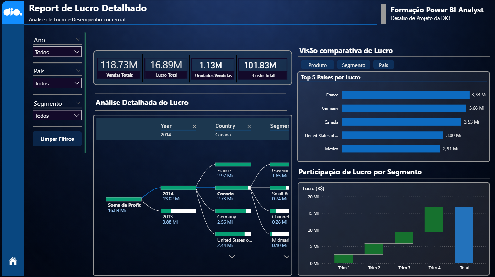
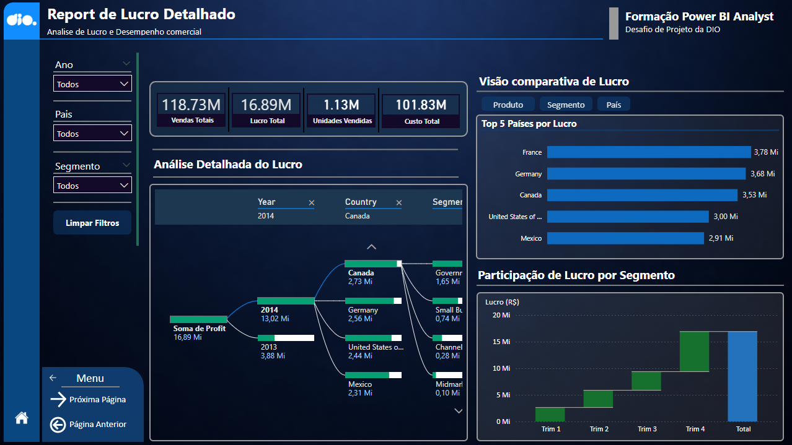

<p align="center">
  
</p>

<p align="center">
Dashboard analítico desenvolvido em <b>Power BI</b> para visualização estratégica de desempenho comercial e análise de lucro.
</p>

<p align="center">
  
  
  
  
</p>

---

## <span style="background: linear-gradient(90deg,#60A5FA,#FACC15); -webkit-background-clip: text; -webkit-text-fill-color: transparent;">`> what_is_this`</span>

Dashboard criado para transformar dados comerciais em **insights rápidos para decisão**.

👉 visão executiva  
👉 análise de lucro  
👉 navegação interativa  

---

## <span style="background: linear-gradient(90deg,#60A5FA,#FACC15); -webkit-background-clip: text; -webkit-text-fill-color: transparent;">`> key_metrics`</span>

✔ lucro total  
✔ vendas totais  
✔ custo operacional  
✔ unidades vendidas  
✔ lucro por país  
✔ lucro por segmento  

---

## <span style="background: linear-gradient(90deg,#60A5FA,#FACC15); -webkit-background-clip: text; -webkit-text-fill-color: transparent;">`> features`</span>

- layout executivo em tema escuro  
- KPIs destacados em cards  
- filtros dinâmicos  
- navegação entre páginas  
- análise visual comparativa  
- storytelling com dados  

---

## <span style="background: linear-gradient(90deg,#60A5FA,#FACC15); -webkit-background-clip: text; -webkit-text-fill-color: transparent;">`> visuals`</span>

✔ cards de indicadores  
✔ gráfico Top Países por lucro  
✔ waterfall de participação  
✔ painel analítico detalhado  
✔ menu interativo  

---

## <span style="background: linear-gradient(90deg,#60A5FA,#FACC15); -webkit-background-clip: text; -webkit-text-fill-color: transparent;">`> preview`</span>

<p align="center">
  
</p>

<p align="center">
  
</p>

---

## <span style="background: linear-gradient(90deg,#60A5FA,#FACC15); -webkit-background-clip: text; -webkit-text-fill-color: transparent;">`> tech_stack`</span>

<p align="center">


</p>

---

## <span style="background: linear-gradient(90deg,#60A5FA,#FACC15); -webkit-background-clip: text; -webkit-text-fill-color: transparent;">`> project_structure`</span>

```
dashboard-desempenho-financeiro
│
├── BI/
│   └── dashboard-desempenho-financeiro.pbix
│
├── Images/
│   ├── Dash.png
│   └── Dash_Menu.png
│
└── README.md
```

---

## <span style="background: linear-gradient(90deg,#60A5FA,#FACC15); -webkit-background-clip: text; -webkit-text-fill-color: transparent;">`> author`</span>

**Christopher Benini**

<p>
  <a href="https://github.com/chrisbenini">
    
  </a>
</p>

---

⭐ Se curtiu o projeto, deixe uma estrela!
